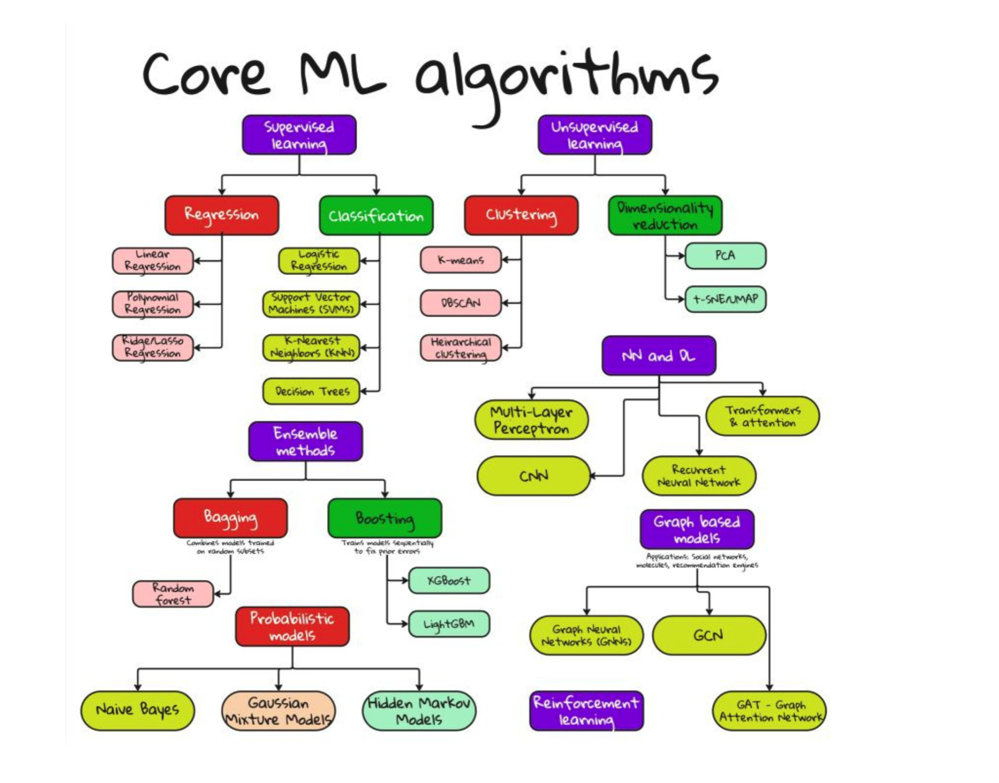

# Core Machine Learning Algorithms: A Detailed Guide

This guide covers the core Machine Learning (ML) algorithms, categorized into supervised learning, unsupervised learning, and deep learning paradigms. Each section includes where and why the algorithms are used, and the ideal conditions for their application.

---

## 1. Supervised Learning

Supervised learning uses labeled data to train models.

### A. Regression

Used when the output is a **continuous value**.

- **Linear Regression**

  - Use case: Predicting house prices, stock values.
  - When: Data has linear relationships.

- **Polynomial Regression**

  - Use case: Predicting non-linear trends.
  - When: Relationship between features and target is non-linear.

- **Ridge/Lasso Regression**

  - Use case: Preventing overfitting.
  - When: Regularization is needed due to high dimensionality or multicollinearity.

### B. Classification

Used when the output is a **categorical value**.

- **Logistic Regression**

  - Use case: Binary classification (e.g., spam detection).
  - When: You need a fast, interpretable model.

- **Support Vector Machines (SVMs)**

  - Use case: Image classification, bioinformatics.
  - When: High-dimensional feature space.

- **K-Nearest Neighbors (KNN)**

  - Use case: Pattern recognition.
  - When: Small dataset with simple decision boundaries.

- **Decision Trees**

  - Use case: Credit scoring, medical diagnosis.
  - When: Interpretability is crucial.

### C. Ensemble Methods

Combine multiple models for better performance.

#### a. Bagging

- **Random Forest**

  - Use case: Feature-rich problems.
  - When: High variance models need to be stabilized.

#### b. Boosting

- **XGBoost / LightGBM**

  - Use case: Kaggle competitions, large datasets.
  - When: High accuracy is needed, and data is tabular.

### D. Probabilistic Models

Based on probability theory.

- **Naive Bayes**

  - Use case: Text classification.
  - When: Conditional independence assumption is reasonable.

- **Gaussian Mixture Models (GMMs)**

  - Use case: Density estimation.
  - When: Data can be assumed to be a mixture of Gaussians.

- **Hidden Markov Models (HMMs)**

  - Use case: Speech recognition, time-series analysis.
  - When: Sequential data with hidden states.

---

## 2. Unsupervised Learning

Used when data is **unlabeled**.

### A. Clustering

Grouping similar data points.

- **K-means**

  - Use case: Market segmentation.
  - When: You know the number of clusters.

- **DBSCAN**

  - Use case: Spatial data clustering.
  - When: Clusters of varying shape and size.

- **Hierarchical Clustering**

  - Use case: Gene expression data.
  - When: A tree-like structure is needed.

### B. Dimensionality Reduction

Reducing feature space for visualization or noise reduction.

- **PCA (Principal Component Analysis)**

  - Use case: Preprocessing for other algorithms.
  - When: Reducing multicollinearity.

- **t-SNE / UMAP**

  - Use case: Data visualization.
  - When: Need to preserve local/global structure.

---

## 3. Neural Networks and Deep Learning

Used for complex, high-dimensional data.

### A. Multi-Layer Perceptron (MLP)

- Use case: Tabular data.
- When: Basic feedforward architecture is sufficient.

### B. Convolutional Neural Networks (CNNs)

- Use case: Image, video, and spatial data.
- When: Spatial hierarchy matters (e.g., edges, shapes).

### C. Recurrent Neural Networks (RNNs)

- Use case: Sequential data (text, time-series).
- When: Temporal dynamics are essential.

### D. Transformers and Attention Mechanisms

- Use case: NLP, vision.
- When: Long-range dependencies are required.

---

## 4. Graph-Based Models

Used when data can be represented as graphs (nodes and edges).

- **Graph Neural Networks (GNNs)**

  - Use case: Social networks, chemical molecules.
  - When: Node connectivity carries information.

- **GCN (Graph Convolutional Network)**

  - Use case: Node classification.
  - When: Local neighborhood aggregation is essential.

- **GAT (Graph Attention Network)**

  - Use case: Adaptive weighting of neighbors.
  - When: Importance of nodes varies.

---

## 5. Reinforcement Learning

Learning by interacting with the environment.

- Use case: Robotics, gaming, real-time decisions.
- When: Decision-making under uncertainty.

---

## Summary Table

| Algorithm Type           | Examples                      | When to Use                              |
| ------------------------ | ----------------------------- | ---------------------------------------- |
| Regression               | Linear, Polynomial, Ridge     | Predicting continuous values             |
| Classification           | SVM, KNN, Logistic Regression | Predicting categories                    |
| Clustering               | K-means, DBSCAN               | Grouping unlabeled data                  |
| Dimensionality Reduction | PCA, t-SNE                    | Visualization, preprocessing             |
| Ensemble Methods         | Random Forest, XGBoost        | Improving model performance              |
| Deep Learning            | CNN, RNN, Transformers        | Complex data like images, text           |
| Graph Models             | GCN, GAT                      | Graph-structured data                    |
| Reinforcement Learning   | Q-Learning, Policy Gradients  | Learning through environment interaction |

---

This guide serves as a comprehensive overview for selecting the right ML algorithm based on the data type, problem statement, and deployment scenario.
